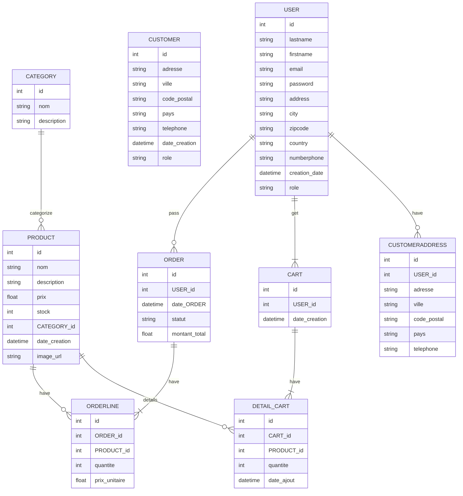

# Site de E-commerce

```mermaid
erDiagram
    USER {
        int id
        string lastname
        string firstname
        string email
        string password
        string address
        string city
        string zipcode
        string country
        string numberphone
        datetime creation_date
        string role
    }

    CUSTOMER {
        int id
        string adresse
        string ville
        string code_postal
        string pays
        string telephone
        datetime date_creation
        string role
    }
    
    PRODUCT {
        int id
        string nom
        string description
        float prix
        int stock
        int CATEGORY_id
        datetime date_creation
        string image_url
    }
    
    CATEGORY {
        int id
        string nom
        string description
    }
    
    ORDER {
        int id
        int USER_id
        datetime date_ORDER
        string statut
        float montant_total
    }
    
    ORDERLINE {
        int id
        int ORDER_id
        int PRODUCT_id
        int quantite
        float prix_unitaire
    }
    
    CART {
        int id
        int USER_id
        datetime date_creation
    }
    
    DETAIL_CART {
        int id
        int CART_id
        int PRODUCT_id
        int quantite
        datetime date_ajout
    }
    
    CUSTOMERADDRESS {
        int id
        int USER_id
        string adresse
        string ville
        string code_postal
        string pays
        string telephone
    }

    USER ||--o{ ORDER : "pass"
    ORDER ||--|{ ORDERLINE : "have"
    PRODUCT ||--o{ ORDERLINE : "have"
    CATEGORY ||--o{ PRODUCT : "categorize"
    USER ||--|{ CART : "get"
    CART ||--|{ DETAIL_CART : "have"
    PRODUCT ||--o{ DETAIL_CART : "details"
    USER ||--o{ CUSTOMERADDRESS : "have"
```